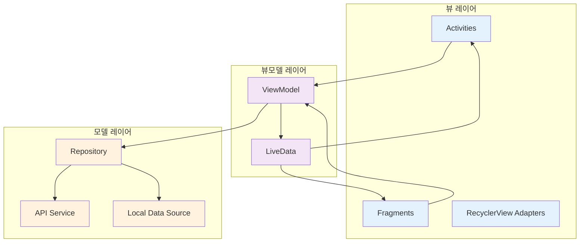

# Android 아키텍처

## 개요

DaySync Android 앱은 **MVVM (Model-View-ViewModel) 아키텍처 패턴**을 채택하여 UI 로직과 비즈니스 로직을 명확히 분리합니다.

---

## MVVM 아키텍처

### 아키텍처 다이어그램



### 계층별 역할

| 계층 | 역할 | 주요 컴포넌트 |
|-----|------|------------|
| **뷰** | UI 렌더링 및 사용자 입력 처리 | Activities, Fragments, Adapters |
| **뷰모델** | UI 상태 관리 및 비즈니스 로직 | RouteViewModel, LiveData |
| **모델** | 데이터 처리 및 저장소 추상화 | Repositories, API Services |

---

## 프로젝트 구조

```
app/src/main/java/com/sjoneon/cap/
├── activities/                 # Activity 클래스
│   ├── MainActivity           # 메인 화면 (채팅 UI)
│   ├── LoginActivity          # 로그인/닉네임 설정
│   └── AlarmActivity          # 알람 울림 화면
│
├── fragments/                  # Fragment 클래스
│   ├── CalendarFragment       # 캘린더/일정 관리
│   ├── AlarmFragment          # 알람 관리
│   ├── RouteFragment          # 버스 경로 탐색
│   ├── WeatherFragment        # 날씨 정보
│   ├── SettingsFragment       # 개인 설정
│   ├── HelpFragment           # 도움말
│   ├── NotificationsFragment  # 알림 목록
│   └── SessionListBottomSheet # 대화 세션 목록
│
├── adapters/                   # RecyclerView 어댑터
│   ├── ChatAdapter            # 채팅 메시지
│   ├── SessionAdapter         # 세션 목록
│   └── HelpAdapter            # 도움말 목록
│
├── models/                     # 데이터 모델
│   ├── api/                   # API 요청/응답 모델
│   └── local/                 # 로컬 데이터 모델
│
├── services/                   # 서비스 인터페이스
│   ├── DaySyncApiService      # 메인 백엔드 API
│   ├── WeatherApiService      # 기상청 API
│   ├── TagoApiService         # 국토교통부 버스 API
│   ├── TmapApiService         # TMAP API
│   └── AlarmService           # 알람 포그라운드 서비스
│
├── repositories/               # 데이터 저장소
│   ├── CalendarEventRepository
│   ├── AlarmRepository
│   └── RouteRepository
│
├── viewmodels/                 # ViewModel
│   └── RouteViewModel
│
├── helpers/                    # 헬퍼 클래스
│   ├── AlarmScheduler
│   ├── NotificationHelper
│   ├── PermissionHelper
│   └── EventAlarmManager
│
├── receivers/                  # BroadcastReceiver
│   ├── AlarmReceiver
│   └── BootReceiver
│
└── utils/                      # 유틸리티 클래스
    └── ApiClient
```

---

## 주요 컴포넌트

### Activities

| Activity | 역할 |
|----------|------|
| **MainActivity** | AI 채팅 인터페이스, 음성 입력, 네비게이션 드로어 |
| **LoginActivity** | 사용자 닉네임 설정 및 UUID 생성 |
| **AlarmActivity** | 알람 울림 화면 |

### Fragments

| Fragment | 역할 |
|----------|------|
| **CalendarFragment** | CalendarView 기반 일정 CRUD |
| **AlarmFragment** | 알람 목록 및 설정 |
| **RouteFragment** | 경로 검색 및 버스 정보 표시 |
| **WeatherFragment** | 기상청 API 기반 날씨 정보 |
| **SettingsFragment** | 사용자 설정 관리 |

### Repositories

Repository 패턴을 통해 데이터 소스를 추상화하여 ViewModel이 데이터 출처를 알 필요가 없도록 합니다.

| Repository | 역할 |
|------------|------|
| **CalendarEventRepository** | 일정 데이터 CRUD |
| **AlarmRepository** | 알람 데이터 관리 |
| **RouteRepository** | 경로 검색 및 캐싱 |

### Services

Retrofit 인터페이스를 통해 각 API와 통신합니다.

| Service | 역할 |
|---------|------|
| **DaySyncApiService** | 백엔드 서버 통신 |
| **WeatherApiService** | 기상청 API 호출 |
| **TagoApiService** | 버스 정보 조회 |
| **TmapApiService** | 보행자 경로 안내 |

---

## 네트워크 통신

### Retrofit 구성
- Base URL 설정
- Gson Converter 사용
- OkHttp Client (타임아웃 30초)

### API 호출 패턴
- 비동기 호출 (Callback 패턴)
- 에러 처리
- 응답 파싱

---

## 데이터 바인딩 및 상태 관리

### LiveData
- UI 상태를 ViewModel에서 관리
- 생명주기를 인식하는 Observable
- Fragment/Activity에서 observe

### ViewModel
- UI 관련 데이터 보유
- 화면 회전 시 데이터 유지
- Repository를 통한 데이터 접근

---

## 권한 관리

### 필요한 권한
- INTERNET: 네트워크 통신
- ACCESS_FINE_LOCATION: 정확한 위치
- ACCESS_COARSE_LOCATION: 대략적인 위치
- RECORD_AUDIO: 음성 인식
- POST_NOTIFICATIONS: 알림 표시
- SCHEDULE_EXACT_ALARM: 정확한 시간 알람

### 런타임 권한 요청
- Android 6.0+ 런타임 권한 처리
- PermissionHelper를 통한 권한 요청

---

## 로컬 데이터 저장

### SharedPreferences
- 사용자 UUID 저장
- 앱 설정 저장

---

## 알람 및 알림

### AlarmManager
- 정확한 시간 알람 설정
- PendingIntent를 통한 AlarmReceiver 호출

### Notification
- NotificationCompat.Builder 사용
- 채널 설정 (Android 8.0+)
- 우선순위 설정

---

## 음성 인식 (STT)

### Android Speech API
- SpeechRecognizer 사용
- RecognitionListener 구현
- 한국어 설정 (ko-KR)

---

## 지도 통합

### 네이버 지도 SDK
- MapView 구성
- 마커 추가
- 경로 그리기 (PathOverlay)
- 카메라 이동

---

## 성능 최적화

### RecyclerView
- ViewHolder 패턴
- DiffUtil을 통한 효율적인 업데이트

### 메모리 누수 방지
- 생명주기에 맞춘 리스너 해제
- WeakReference 사용 (필요시)

---

## 코딩 컨벤션

### 네이밍 규칙
- 클래스: PascalCase
- 메서드/변수: camelCase
- 상수: UPPER_SNAKE_CASE
- 리소스: kebab-case

### 패키지 구조
- 기능별 패키지 분리
- com.sjoneon.cap.{기능명}

---

## 관련 문서

- [시스템 개요](./system-overview.md)
- [백엔드 아키텍처](./backend-architecture.md)
- [데이터베이스 스키마](./database-schema.md)
