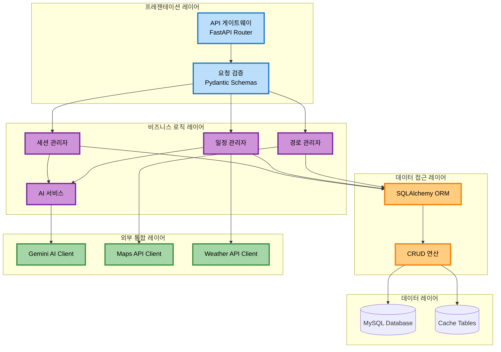

# 백엔드 아키텍처

## 개요

DaySync 백엔드는 **FastAPI 프레임워크**를 기반으로 RESTful API를 제공하며, **계층형 아키텍처**를 채택하여 관심사를 명확히 분리합니다.

---

## 아키텍처 구조

### 계층형 아키텍처 다이어그램



### 계층별 책임

| 계층 | 역할 | 주요 컴포넌트 |
|-----|------|-------------|
| **프레젠테이션** | HTTP 요청/응답 처리 | API Gateway, Pydantic Schemas |
| **비즈니스 로직** | 비즈니스 규칙 및 서비스 조정 | Managers, AI Service |
| **데이터 접근** | 데이터베이스 접근 추상화 | SQLAlchemy ORM, CRUD |
| **외부 통합** | 외부 API 통합 | API Clients |
| **데이터** | 데이터 영속성 | MySQL, Cache |

---

## 프로젝트 구조

```
DaySync_Server/
├── app/
│   ├── __init__.py
│   ├── main.py                  # FastAPI 애플리케이션 진입점
│   ├── database.py              # 데이터베이스 연결 및 세션 관리
│   ├── models.py                # SQLAlchemy ORM 모델
│   ├── schemas.py               # Pydantic 스키마 (요청/응답)
│   │
│   └── routers/                 # API 라우터 (도메인별 분리)
│       ├── __init__.py
│       ├── users.py             # 사용자 관련 API
│       ├── ai_chat.py           # Gemini AI 채팅 API
│       ├── calendar_alarm.py    # 일정/알람 관리 API
│       └── routes.py            # 경로 검색 API
│
├── .env                         # 환경 변수
├── requirements.txt             # Python 의존성
└── run.py                       # 서버 실행 스크립트
```

---

## 주요 컴포넌트

### main.py
- FastAPI 앱 생성
- CORS 설정
- 라우터 등록
- 전역 예외 처리

### database.py
- SQLAlchemy 엔진 생성
- 세션 팩토리
- 의존성 주입 함수 (get_db)
- 연결 풀 관리

### models.py
- ORM 모델 정의
- 테이블 관계 설정 (relationship)
- 인덱스 정의

### schemas.py
- Pydantic 스키마 정의
- 요청/응답 데이터 검증
- 타입 힌팅
- 커스텀 validator

---

## API 라우터

### users.py - 사용자 관리

| 엔드포인트 | 메서드 | 설명 |
|-----------|--------|------|
| `/api/users/` | POST | 새 사용자 생성 |
| `/api/users/{uuid}` | GET | 사용자 정보 조회 |
| `/api/users/{uuid}` | PUT | 사용자 정보 수정 |
| `/api/users/{uuid}` | DELETE | 사용자 삭제 (논리적) |

### ai_chat.py - AI 채팅

| 엔드포인트 | 메서드 | 설명 |
|-----------|--------|------|
| `/api/ai/chat` | POST | AI 메시지 전송 |
| `/api/ai/sessions/{user_uuid}` | GET | 세션 목록 조회 |
| `/api/ai/sessions/{session_id}/messages` | GET | 세션 메시지 조회 |
| `/api/ai/sessions/{session_id}` | DELETE | 세션 삭제 |

**주요 기능**:
- Gemini Function Calling 통합
- 대화 컨텍스트 유지
- 사용자 의도 분석
- 구조화된 데이터 추출

### calendar_alarm.py - 일정/알람

| 엔드포인트 | 메서드 | 설명 |
|-----------|--------|------|
| `/api/schedule/calendar/events` | POST | 일정 생성 |
| `/api/schedule/calendar/events/{user_uuid}` | GET | 일정 목록 조회 |
| `/api/schedule/calendar/events/{event_id}` | PUT | 일정 수정 |
| `/api/schedule/calendar/events/{event_id}` | DELETE | 일정 삭제 |
| `/api/schedule/alarms` | POST | 알람 생성 |
| `/api/schedule/alarms/{user_uuid}` | GET | 알람 목록 조회 |

### routes.py - 경로 검색

| 엔드포인트 | 메서드 | 설명 |
|-----------|--------|------|
| `/api/routes/search` | POST | 경로 검색 (캐싱 지원) |
| `/api/routes/bus/stops` | GET | 주변 버스 정류장 조회 |
| `/api/routes/bus/arrivals` | GET | 실시간 버스 도착 정보 |

---

## 비동기 처리

### async/await 패턴
- 블로킹 없는 I/O 처리
- 높은 동시성 달성
- 외부 API 호출 시 활용

---

## 캐싱 전략

### 경로 캐싱
- TTL: 30분
- 출발지/목적지 기반 캐시 키
- 만료된 캐시 자동 삭제

### 날씨 캐싱
- TTL: 10분
- 위치 기반 캐시 키

### 버스 도착 정보
- TTL: 1분
- 실시간성 유지

---

## 에러 처리

### 전역 예외 핸들러
- HTTPException 처리
- 일반 예외 처리
- 에러 로깅

### 에러 응답 형식
- status_code
- error 메시지
- detail 정보

---

## 로깅

### 로깅 설정
- 파일 핸들러
- 스트림 핸들러
- 로그 레벨: INFO

### 로그 대상
- API 요청/응답
- 에러 발생 시
- 외부 API 호출

---

## 보안

### 환경 변수 관리
- .env 파일 사용
- Git 저장소 제외
- 민감 정보 분리

### SQL Injection 방지
- SQLAlchemy ORM 사용
- 파라미터화된 쿼리

### CORS 설정
- 허용 도메인 설정
- 프로덕션 환경에서 제한

---

## 성능 최적화

### 연결 풀 관리
- pool_size: 10
- max_overflow: 20
- pool_timeout: 30초
- pool_recycle: 1시간

### 쿼리 최적화
- Eager Loading (joinedload)
- 인덱스 활용
- 페이지네이션

---

## 배포 고려사항

### 서버 실행 방식
- 개발: 코드 변경 자동 감지 및 재시작
- 프로덕션: 멀티 워커를 통한 동시성 처리

### 서비스 관리
- 백그라운드 서비스 등록
- 자동 재시작 정책
  
---

## 관련 문서

- [시스템 개요](./system-overview.md)
- [Android 아키텍처](./android-architecture.md)
- [데이터베이스 스키마](./database-schema.md)
