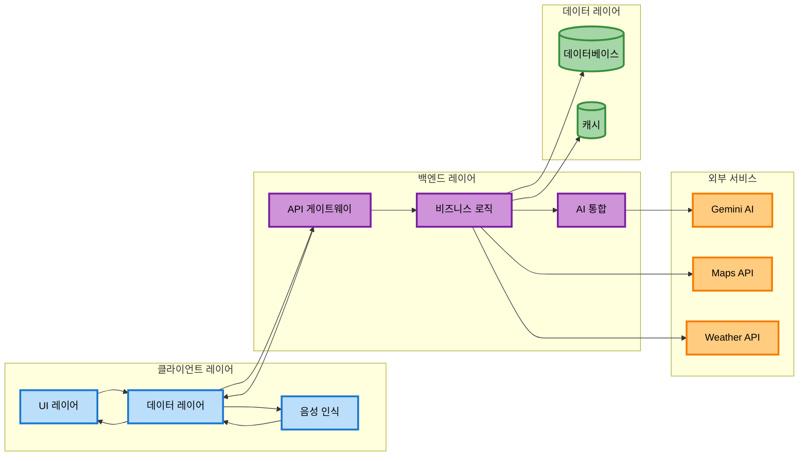

# 시스템 개요

## 프로젝트 소개

**DaySync**는 AI 기반 일정 관리 및 교통 정보 통합 애플리케이션입니다. 사용자가 자연어로 대화하듯이 일정을 관리하고, 실시간 교통 정보와 날씨를 고려한 최적의 경로를 추천받을 수 있습니다.

### 핵심 기능
- AI 대화형 인터페이스를 통한 일정 관리
- 실시간 교통 정보 통합
- 스마트 경로 추천
- 날씨 정보 연동

---

## 시스템 아키텍처

### 전체 구조

DaySync는 **3-Tier 클라이언트-서버 아키텍처**를 채택합니다.



### 아키텍처 레이어

| 레이어 | 역할 | 주요 기술 |
|-------|------|----------|
| **프레젠테이션** | 사용자 인터페이스 및 상호작용 | Android, Java, MVVM |
| **애플리케이션** | 비즈니스 로직 처리 및 서비스 조정 | FastAPI, Python |
| **데이터** | 데이터 영속성 및 캐싱 | MySQL, Cache Tables |
| **통합** | 외부 서비스 통합 | Gemini AI, Maps, Weather APIs |

---

## 주요 데이터 플로우

### 시나리오 1: 음성으로 일정 생성

```
1. 사용자 음성 입력
   "내일 오후 3시에 강남역에서 회의 일정 잡아줘"

2. [Android] STT 변환
   음성 → 텍스트 변환

3. [Android] API 요청
   POST /api/ai/chat

4. [FastAPI] Gemini AI 분석
   Function Calling으로 사용자 의도 파악

5. [Gemini AI] 응답
   구조화된 일정 데이터 반환

6. [FastAPI] 데이터베이스 저장
   calendars 테이블에 저장

7. [Android] UI 업데이트
   캘린더 뷰에 일정 표시
```

### 시나리오 2: 경로 검색 및 캐싱

```
1. 사용자 경로 검색 요청

2. [FastAPI] 캐시 확인
   route_cache 테이블 조회

3-A. 캐시 HIT
     저장된 경로 데이터 반환

3-B. 캐시 MISS
     외부 API 호출 (TMAP, TAGO, Naver Maps)
     응답 캐싱 (TTL: 30분)
```

---

## 기술 스택

### Frontend (Android)

| 구분 | 기술 | 버전 |
|-----|------|------|
| 언어 | Java | JDK 21 |
| 플랫폼 | Android SDK | minSdk 24, targetSdk 35 |
| 아키텍처 | ViewModel, LiveData | 2.6.2 |
| 네트워크 | Retrofit, OkHttp | 2.9.0, 4.12.0 |
| 지도 | 네이버 지도 SDK | 3.22.0 |
| 위치 | Google Play Services | 21.3.0 |
| 푸시 | Firebase FCM | 34.6.0 |

### Backend (FastAPI)

| 구분 | 기술 | 버전 |
|-----|------|------|
| 언어 | Python | 3.11+ |
| 프레임워크 | FastAPI | 0.104.1 |
| 서버 | Uvicorn | 0.24.0 |
| ORM | SQLAlchemy | 2.0.23 |
| 검증 | Pydantic | 2.5.1 |
| AI SDK | google-generativeai | 0.8.3 |

### Infrastructure

| 구분 | 기술 |
|-----|------|
| 서버 | AWS EC2 |
| 데이터베이스 | AWS RDS (MySQL 8.0+) |
| AI 모델 | Gemini 2.5 Flash |

### External APIs

| API | 제공처 | 용도 |
|-----|--------|------|
| Gemini 2.5 Flash | Google | AI 대화 및 Function Calling |
| TMAP API | SK텔레콤 | 보행자 경로 안내 |
| 국토교통부 TAGO API | 공공데이터포털 | 실시간 버스 정보 |
| 네이버 Maps API | 네이버 클라우드 | 지도, Geocoding, Directions |
| 기상청 단기예보 API | 공공데이터포털 | 날씨 정보 |

---

## 시스템 요구사항

### 클라이언트
- Android 7.0 (API 24) 이상
- 필수 권한: 위치, 마이크, 알림, 인터넷

### 서버
- Ubuntu 20.04+ / Windows Server
- Python 3.11+
- 메모리 2GB 이상

### 데이터베이스
- MySQL 8.0+
- utf8mb4 인코딩

---

## 보안 고려사항

### API 키 관리
- local.properties (Android)
- 환경변수 .env (Backend)
- Git 저장소 제외

### 통신 보안
- HTTPS 통신
- API 키 헤더 전송
- SSL/TLS 인증서

### 데이터 보안
- UUID 기반 사용자 식별
- 논리적 삭제 (is_deleted 플래그)

---

## 성능 고려사항

### 캐싱 전략
| 데이터 | TTL |
|--------|-----|
| 경로 정보 | 30분 |
| 날씨 정보 | 10분 |
| 버스 도착 정보 | 1분 |

### 데이터베이스 최적화
- 인덱스 설정: 자주 조회되는 컬럼
- 복합 인덱스: user_uuid, start_time 등

### 비동기 처리
- FastAPI async/await 패턴
- 높은 동시성 처리

---

## 관련 문서

- [Android 아키텍처](./android-architecture.md)
- [백엔드 아키텍처](./backend-architecture.md)
- [데이터베이스 스키마](./database-schema.md)
