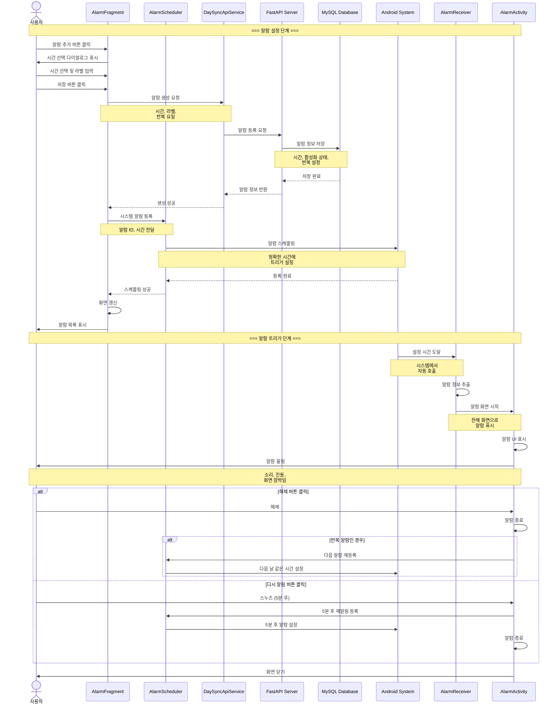

```mermaid
  sequenceDiagram
      actor User as 사용자
      participant AF as AlarmFragment
      participant Scheduler as AlarmScheduler
      participant API as DaySyncApiService
      participant Server as FastAPI Server
      participant DB as MySQL Database
      participant OS as Android System
      participant Receiver as AlarmReceiver
      participant AA as AlarmActivity
  
      Note over User,AA: === 알람 설정 단계 ===
      
      User->>AF: 알람 추가 버튼 클릭
      AF->>User: 시간 선택 다이얼로그 표시
      User->>AF: 시간 선택 및 라벨 입력
      User->>AF: 저장 버튼 클릭
      
      AF->>API: 알람 생성 요청
      Note over AF,API: 시간, 라벨,<br/>반복 요일
      
      API->>Server: 알람 등록 요청
      
      Server->>DB: 알람 정보 저장
      Note over Server,DB: 시간, 활성화 상태,<br/>반복 설정
      
      DB-->>Server: 저장 완료
      
      Server-->>API: 알람 정보 반환
      
      API-->>AF: 생성 성공
      
      AF->>Scheduler: 시스템 알람 등록
      Note over AF,Scheduler: 알람 ID, 시간 전달
      
      Scheduler->>OS: 알람 스케줄링
      Note over Scheduler,OS: 정확한 시간에<br/>트리거 설정
      
      OS-->>Scheduler: 등록 완료
      
      Scheduler-->>AF: 스케줄링 성공
      
      AF->>AF: 화면 갱신
      AF->>User: 알람 목록 표시
      
      Note over User,AA: === 알람 트리거 단계 ===
      
      OS->>Receiver: 설정 시간 도달
      Note over OS,Receiver: 시스템에서<br/>자동 호출
      
      Receiver->>Receiver: 알람 정보 추출
      
      Receiver->>AA: 알람 화면 시작
      Note over Receiver,AA: 전체 화면으로<br/>알람 표시
      
      AA->>AA: 알람 UI 표시
      
      AA->>User: 알람 울림
      Note over AA,User: 소리, 진동,<br/>화면 깜박임
      
      alt 해제 버튼 클릭
          User->>AA: 해제
          AA->>AA: 알람 종료
          
          alt 반복 알람인 경우
              AA->>Scheduler: 다음 알람 재등록
              Scheduler->>OS: 다음 날 같은 시간 설정
          end
          
      else 다시 알림 버튼 클릭
          User->>AA: 스누즈 (5분 후)
          AA->>Scheduler: 5분 후 재알림 등록
          Scheduler->>OS: 5분 후 알람 설정
          AA->>AA: 알람 종료
      end
      
      AA->>User: 화면 닫기
```
