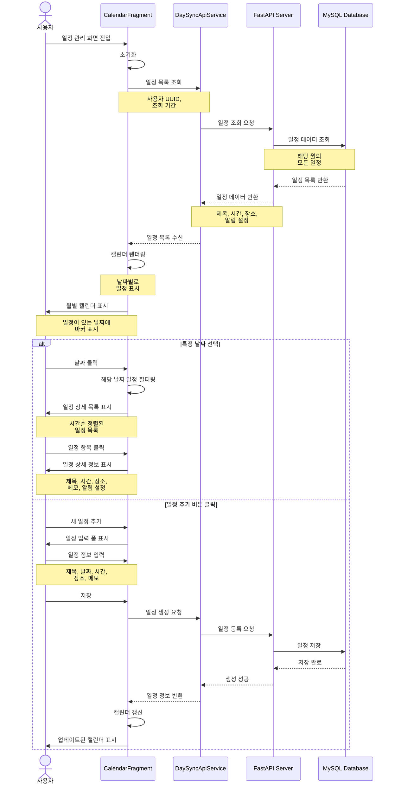

```mermaid
  sequenceDiagram
      actor User as 사용자
      participant CF as CalendarFragment
      participant API as DaySyncApiService
      participant Server as FastAPI Server
      participant DB as MySQL Database
  
      User->>CF: 일정 관리 화면 진입
      
      CF->>CF: 초기화
      
      CF->>API: 일정 목록 조회
      Note over CF,API: 사용자 UUID,<br/>조회 기간
      
      API->>Server: 일정 조회 요청
      
      Server->>DB: 일정 데이터 조회
      Note over Server,DB: 해당 월의<br/>모든 일정
      
      DB-->>Server: 일정 목록 반환
      
      Server-->>API: 일정 데이터 반환
      Note over Server,API: 제목, 시간, 장소,<br/>알림 설정
      
      API-->>CF: 일정 목록 수신
      
      CF->>CF: 캘린더 렌더링
      Note over CF: 날짜별로<br/>일정 표시
      
      CF->>User: 월별 캘린더 표시
      Note over CF,User: 일정이 있는 날짜에<br/>마커 표시
      
      alt 특정 날짜 선택
          User->>CF: 날짜 클릭
          
          CF->>CF: 해당 날짜 일정 필터링
          
          CF->>User: 일정 상세 목록 표시
          Note over CF,User: 시간순 정렬된<br/>일정 목록
          
          User->>CF: 일정 항목 클릭
          
          CF->>User: 일정 상세 정보 표시
          Note over CF,User: 제목, 시간, 장소,<br/>메모, 알림 설정
          
      else 일정 추가 버튼 클릭
          User->>CF: 새 일정 추가
          
          CF->>User: 일정 입력 폼 표시
          
          User->>CF: 일정 정보 입력
          Note over User,CF: 제목, 날짜, 시간,<br/>장소, 메모
          
          User->>CF: 저장
          
          CF->>API: 일정 생성 요청
          
          API->>Server: 일정 등록 요청
          
          Server->>DB: 일정 저장
          
          DB-->>Server: 저장 완료
          
          Server-->>API: 생성 성공
          
          API-->>CF: 일정 정보 반환
          
          CF->>CF: 캘린더 갱신
          
          CF->>User: 업데이트된 캘린더 표시
      end
```
