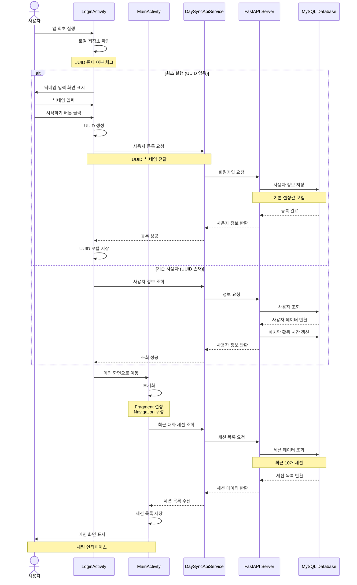

```mermaid
  sequenceDiagram
      actor User as 사용자
      participant LA as LoginActivity
      participant MA as MainActivity
      participant API as DaySyncApiService
      participant Server as FastAPI Server
      participant DB as MySQL Database
  
      User->>LA: 앱 최초 실행
      
      LA->>LA: 로컬 저장소 확인
      Note over LA: UUID 존재 여부 체크
      
      alt 최초 실행 (UUID 없음)
          LA->>User: 닉네임 입력 화면 표시
          User->>LA: 닉네임 입력
          User->>LA: 시작하기 버튼 클릭
          
          LA->>LA: UUID 생성
          
          LA->>API: 사용자 등록 요청
          Note over LA,API: UUID, 닉네임 전달
          
          API->>Server: 회원가입 요청
          
          Server->>DB: 사용자 정보 저장
          Note over Server,DB: 기본 설정값 포함
          
          DB-->>Server: 등록 완료
          
          Server-->>API: 사용자 정보 반환
          
          API-->>LA: 등록 성공
          
          LA->>LA: UUID 로컬 저장
          
      else 기존 사용자 (UUID 존재)
          LA->>API: 사용자 정보 조회
          
          API->>Server: 정보 요청
          
          Server->>DB: 사용자 조회
          DB-->>Server: 사용자 데이터 반환
          
          Server->>DB: 마지막 활동 시간 갱신
          
          Server-->>API: 사용자 정보 반환
          
          API-->>LA: 조회 성공
      end
      
      LA->>MA: 메인 화면으로 이동
      
      MA->>MA: 초기화
      Note over MA: Fragment 설정<br/>Navigation 구성
      
      MA->>API: 최근 대화 세션 조회
      
      API->>Server: 세션 목록 요청
      
      Server->>DB: 세션 데이터 조회
      Note over Server,DB: 최근 10개 세션
      
      DB-->>Server: 세션 목록 반환
      
      Server-->>API: 세션 데이터 반환
      
      API-->>MA: 세션 목록 수신
      
      MA->>MA: 세션 목록 저장
      
      MA->>User: 메인 화면 표시
      Note over MA,User: 채팅 인터페이스
```
