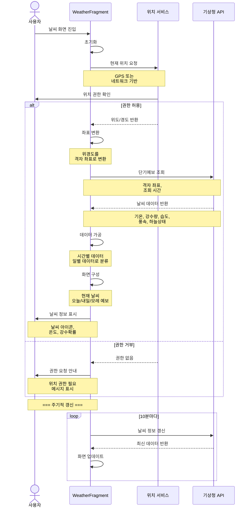

```mermaid
  sequenceDiagram
      actor User as 사용자
      participant WF as WeatherFragment
      participant Location as 위치 서비스
      participant API as 기상청 API
      participant WF as WeatherFragment
  
      User->>WF: 날씨 화면 진입
      
      WF->>WF: 초기화
      
      WF->>Location: 현재 위치 요청
      Note over WF,Location: GPS 또는<br/>네트워크 기반
      
      Location->>User: 위치 권한 확인
      
      alt 권한 허용
          Location-->>WF: 위도/경도 반환
          
          WF->>WF: 좌표 변환
          Note over WF: 위경도를<br/>격자 좌표로 변환
          
          WF->>API: 단기예보 조회
          Note over WF,API: 격자 좌표,<br/>조회 시간
          
          API-->>WF: 날씨 데이터 반환
          Note over API,WF: 기온, 강수량, 습도,<br/>풍속, 하늘상태
          
          WF->>WF: 데이터 가공
          Note over WF: 시간별 데이터<br/>일별 데이터로 분류
          
          WF->>WF: 화면 구성
          Note over WF: 현재 날씨<br/>오늘/내일/모레 예보
          
          WF->>User: 날씨 정보 표시
          Note over WF,User: 날씨 아이콘,<br/>온도, 강수확률
          
      else 권한 거부
          Location-->>WF: 권한 없음
          
          WF->>User: 권한 요청 안내
          Note over WF,User: 위치 권한 필요<br/>메시지 표시
      end
      
      Note over User,WF: === 주기적 갱신 ===
      
      loop 10분마다
          WF->>API: 날씨 정보 갱신
          API-->>WF: 최신 데이터 반환
          WF->>WF: 화면 업데이트
      end
```
